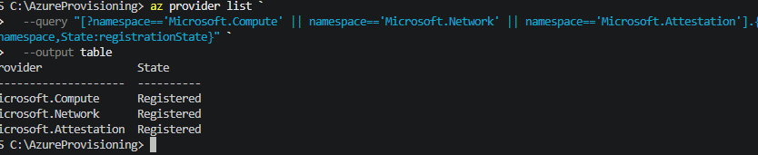

# The Azure region must support the required AMD SEV-SNP VM size. Check available confidential VM sizes before deploymen
az vm list-skus `
  --location "centralus" `
  --resource-type virtualMachines `
  --query "[?contains(name, 'DCasv5') || contains(name, 'ECasv5')].{Name:name,Restrictions:restrictions}" `
  --output table
  # Quota for confidential VM sizes
  Your subscription must have sufficient regional vCPU quota for the selected confidential VM size. If deployment fails because of quota, request a quota increase through Azure or choose another supported size.
  #  Required Azure resource providers
  Register the providers needed for the VM, networking, and attestation service:
  az provider register --namespace Microsoft.Compute
  az provider register --namespace Microsoft.Network
  az provider register --namespace Microsoft.Attestation
  
#Attestation region availability
Azure Attestation is not available in every Azure region. Check supported locations:
az provider show `
  --namespace Microsoft.Attestation `
  --expand "resourceTypes/locations" `
  --query "resourceTypes[?resourceType=='attestationProviders'].locations[]" `
  --output table